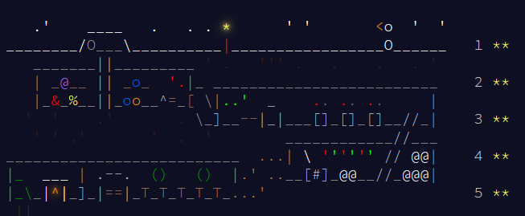

# Advent of Code 2025 solutions

## Current Progress


| Day | Solution | Score |
|-----|-------| ----- |
| [1](https://adventofcode.com/2025/day/1) | [day01.ts](src/days/day01.ts)   | **    |
| [2](https://adventofcode.com/2025/day/2) | [day02.ts](src/days/day02.ts)   | **    |
| [3](https://adventofcode.com/2025/day/3) | [day03.ts](src/days/day03.ts)   | **    |
| [4](https://adventofcode.com/2025/day/4) | [day03.ts](src/days/day04.ts)   | **    |

## Requirements

- Node.js 18+
- npm

## Setup

```
npm install
```

## Running solutions

The runner expects:

```
npm run dev -- <day> <part> [sample]
```

- `<day>`: 1–12  
- `<part>`: `1` or `2`  
- Optional `sample` flag uses the puzzle's provided sample input instead of real input.

Examples:

```
# Day 1, part 1 with real input
npm run dev -- 1 1

# Day 2, part 2 with test input
npm run dev -- 2 2 sample
```

Puzzle inputs live under `inputs/dayXX/`:

```
inputs/
  day01/
    input.txt
    sample.txt
  day02/
    input.txt
    sample.txt
  ...
```

## Project structure

```
src/
  index.ts          # CLI entrypoint / day router
  utils/
    input.ts        # input helpers, etc.
  days/
    day01.ts        # Day 1 solutions (part1, part2)
    day02.ts
    day03.ts
    ...
```

Each `dayXX.ts` exports:

- `part1(input: string): number | string`
- `part2(input: string): number | string`
